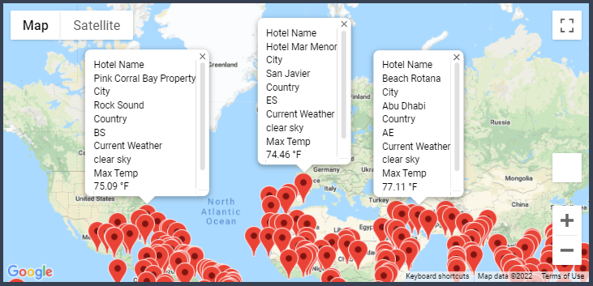
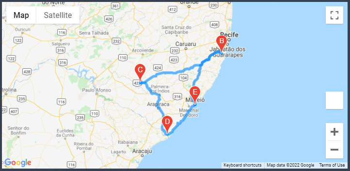

# World_Weather_Analysis
## Resources
*   Software: 
    *   Anaconda 4.11.0
    *   Jupyter Notebook 6.4.5 
    *   Python 3.9.7
    *   Visual Studio Code 1.63.2

*   APIs:
    *   OpenWeatherMap API
    *   Google Places API 
    *   Google Directions API

## Overview/Purpose
The goals of this analysis was to use [OpenWeather's API](https://openweathermap.org/api) and [Google Maps' APIs](https://mapsplatform.google.com/) to find vacation spots per the users weather  preferences, in this case specifically filtering for temperature ranges.

The goals included:
*   Retrieve all relative weather information
    *   Location (Latitude/Longitude)
    *   Max Temperature 
    *   Percent Humidity
    *   Percent Cloudiness
    *   Wind Speed
    *   Current Conditions (e.g., partly cloudy, light rain, fog, clear, etc.)
*   Filter user location preferences based on temperature ranges
*   Display all possible hotel choices based on user preferences
*   Generate a travel itinerary map for a vacation involving traveling to multiple cities.

## Building the Weather/Vacation Code
Obtaining the weather information was done using the OpenWeatherMap API from a list of randomly generated cities around the world. The data provided from OpenWeatherMap was converted to a a JSON format and then parsed out for the relative data into a DataFrame.

This data was then filter via user input using this code:

```
min_temp = float(input("What is the minimum temperature you would like for your trip? "))
max_temp = float(input("What is the maximum temperature you would like for your trip? "))
preferred_cities_df = city_data_df.loc[(city_data_df["Max Temp"] <= max_temp) & \ (city_data_df["Max Temp"] >= min_temp)]
```
After the user puts in their temp preference, cities are filter down to meet them and after hotels within these locations are found via the Google Places API. Those hotels are then visualized for them via Google Maps with a marker layer by using the `gmaps.marker_layer()` function

Here is a screen shot of the marker map with the information in a pop-up:

* Note that since this was completed in February, I expanded my example temp range to get more possible vacation spots.

## Creating an Itinerary
This project also asked me to make an example itinerary using the Google Directions API to show an example of the users travel plans if they were to be moving to different locations during their trip.

To do this I picked four cities/hotels within a relatively close distance in a random Country, in my case Brazil. Using a similar function like before with the marker layer, I used the `gmaps.directions_layer()` function to establish a route between the four locations.

Here is a screen shot of the map with the direction layer.

* Note that the marker 'E' is also the starting location, marker 'A', but the end marker is blocking the starting one from view

## Outcomes
With further building and refactoring, this code could be used to generate example vacation ideas/plans for users based on more than just their weather preferences, but any number of options!
